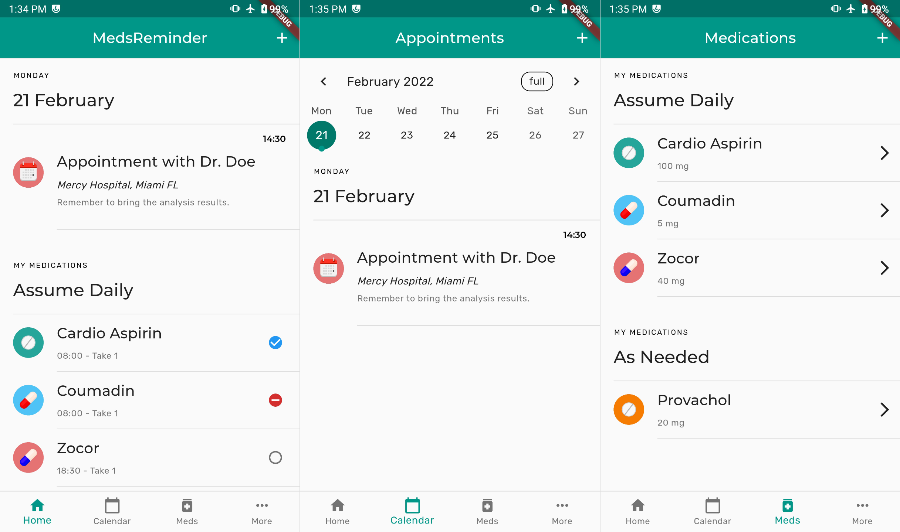

# MedsReminder - Progetto Mobile Development

### Autore/i:
- Marzona Eugenio - 128623

## Una breve descrizione
Questo repository contiene il sorgente dell'applicazione flutter sviluppata per il corso di "Mobile Development" dell'Università degli Studi di Udine.

Si tratta di una semplice agenda digitale per tenere traccia di farmaci da assumere ed appuntamenti medici.

## Compilare il progetto
L'applicazione è stata testata (in modo non estensivo) su un dispositivo con Andriod 10 (Le eco le max 2).

Per la compilazione ho utilizzato la versione 2.8.0 di flutter, in quanto ho riscontrato problemi di compatibilità con alcuni dei pacchetti utilizzati con l'ultima vesione disponibile per macOS.

L'apk già compilato è disponibile nella sezione _Releases_ di questo repository.

Per evitare problemi in fase di compilazione consiglio in ogni caso di effettuare un cleanup del progetto ...
    
    cd ./medsreminder
    flutter clean
    flutter pub cache repair
    flutter pub get
    flutter build apk

**Nota:** L'unica versione testata è quella Android

## Pacchetti utilizzati
Per lo sviluppo di alcune delle feature dell'applicazione sono stati utlizzati i seguenti pacchetti:
* `path/path_provider` -> Per l'accesso semplificato ai file locali
* `sqflite` -> Persistenza (locale) dei dati inseriti dall'utente
* `provider` -> Utilizzato in maniera estensiva per gestire inserimento, modifica e cancellazione di farmaci, reminder e appuntamenti, per la gestione delle preferenze globali, per la costruzione dinamica delle schermate dell'applicazione ecc...
* `table_calendar` -> Widget 'calendario' utilizzato nella schermata omonima.
* `datetime_picker_formfield` -> Widget date picker utilizzato nei form.
* `flutter_local_notifications` -> Per lo scheduling delle notifiche e reminder giornalieri.
* `cron` -> Per 'resettare' i reminder di assunzione farmaci al termine della giornata.
* `google_fonts`
* `shared_preferences`

## Feature implementate
Rispetto alle feature previste nella prima parte del progetto, sono state implementate tutte le feature a priorità alta e gran parte di quelle a priorità media.

## Risorse utili
La documentazione del pacchetto **flutter_local_notifications** è di difficile lettura e gli esempi disponibili sono poco chiari. Questo articolo di _Medium_ spiega come effettuarne il setup:

- https://medium.com/flutter-community/local-notifications-in-flutter-746eb1d606c6

Alcuni spunti per lavorare con form con campi dinamici:
- https://yatindeokar33.medium.com/working-with-dynamic-multi-form-in-flutter-with-validation-73ed03833874

Lavorare con database in flutter (SQLite/Firebase):
- https://www.tutorialspoint.com/flutter/flutter_database_concepts.htm

Concetti base di _Material Design_:
- https://www.youtube.com/watch?v=stoJpMeS5aY

## Asset
I font utilizzati provengono dalla collezione [Google Fonts](https://fonts.google.com/) e sono sotto Licenze Open.

Le icone provengono dalla collezione [Font Awesome 3](https://fontawesome.com/icons) (licenza SIL) e dal pacchetto di icone material di flutter.

Le immagini utilizzate sono state realizzate da me per questo progetto.

## Stumenti utilizzati
- **VS Code**
- **Affinity Designer** e **Affinity Photo**

## Problemi noti
- Il toggle per la modalità scura presente nel menù opzioni non aggiorna sempre lo stato correttamente